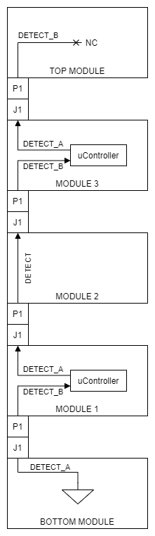

# Modular Payload System Specifications
Revision: Draft

## Overview
These specifications are split into two categories, General Requirements that all module developers shall follow, and a following section that pertains only to modules that meet the High Reliability Requirements (HR)

## Naming Conventions

Bus modules have a basic naming scheme in the format XXX-NNM, for example CPU-010. The prefix letters define the type of module. The two numbers NN define the board number. The last number M, defines the assembly variant. 

| Prefix | Type                                                         |
| :----: | :----------------------------------------------------------- |
|  PSU   | Power Supply Module. Should also be used for power related modules, if for example, you needed to power external devices from the BUS rails. |
|  DBG   | Debug/Development Module                                     |
|  TOP   | Top Module. Design to terminate the top of the stack.        |
|  BOT   | Bottom Module. Design to terminate the bottom of the stack.  |
|  CPU   | Flight Computer Module                                       |
|   IO   | IO board. Includes modules for driving relays, pyros, etc.   |
|  BAT   | Battery Module. This is any module that generates the +VBAT rail. |
|  AUX   | Auxiliary Modules for doing *weird* stuff.                   |
|  TMP   | Template Modules                                             |


## General Specifications
1. Documentation
    1. Module naming shall conform to the naming convention outlined in this document. (This is not required for 3rd party modules, but is required if they will be contributed to LBR's repository.)
    2. Module schematics shall be licensed CC BY-NC 4.0
    3. A compliance matrix shall be filled out. A template one can be generated using by running ```python ./Scripts/generate-compliance-matrix.py ``` from the root directory of this repository. (This is not required for 3rd party modules, but is required if they will be contributed to LBR's repository.)
    4. Modules shall be labeled with a revision letter. (Follow ASME guidelines, Capitol letter A, B, C, ..., Z, AA, AB, etc. The letters I, O, P, Q, S, and Z shall be skipped)
2. Performance
    1. Electrical connectors shall have continuous current carrying capacity derated to 80%.
    2. Ceramic capacitors shall be derated to 60% operating Voltage. Partial non compliance here is acceptable if the derating failure is only due to voltage rail tolerance.
    3. Polymer tantalum capacitors shall be derated to 80% operating Voltage
    4. Polymer tantalums shall be sourced from reputable manufacturers (KEMET, AVX, etc.) No other type of polarized capacitor should be used. (The goal here is to provide safe operation for the entire bus in hot environments and at high altitudes/low pressure. Deviation from this requirement is allowed, but should be done with extreme caution)
    5. Tjmax for all ICs and discrete components should be derated to 80%
    6. All passive electrical components shall be AEC-Q200 qualified
    7. All discrete components shall be AEC-Q101 qualified
    8. All IC should be AEC-Q100 qualified. If the IC is not AEC-Q100 qualified, then it should have a pin compatible/orderable part that is AEC-Q100 qualified. (The goal here is that if the user wants to pay the extra or jump through the purchasing hurdles to actually get an AEC-Q100 part then they can, but it should be the same. For example the ATSAMC21 that is planned for this project has a AEC-Q100 qualified PN suffix, but they are non-stock. We would have to order a full reel. But by using this part, we have the option to simply order the AEC-Q100 part in the future if needed.)
    9. When digital communication and clocks greater than 25.575Mhz are used, the frequency should be chosen such that there are no odd harmonics in the L1 GPS band (1575.42 MHz  +/- 15.345 MHz). Digital frequencies keep out table included for reference below. For example, clock frequencies of 48MHz are not allow because they are between 47.275MHz and 48.205MHz and will produce a 33rd harmonic in the L1 GPS band. 48.25MHz, for example is allowed. If frequencies are used that are in the frequency keep out regions, shielding options should be evaluated in order to prevent conducted or radiated emission from interfering with GPS receivers. If an applications uses GPS other than L1, a frequency keep out table should be made by dividing the the upper and lower bandwidth limits of the band by odd divisors. See [Table 1](#table-1)
    10. Pinout
        1. J1 / P1 bus signal connector shall conform to the pinout located in [Table 4](#table-4)
        2. J2 / P2 bus power connector shall conform to the pinout locate in [Table 5](#table-5)
    11. BUS Power
        1. All power rails shall be connected to both the top and bottom bus connectors, even if the rails are unused on the module.
        2. +VBAT Rail
            1. +VBAT rail shall be 12.8VDC to 34VDC
            2. +VBAT rail steady state current shall be no more than 7.6A
            3. Total +VBAT rail transient current shall be < 1.5x max rated current of 7.6A * 1.5 =  11.4A (this includes inrush or any other transient loads, such as when radios are transmitting, etc.)
            4. Rise time shall be no faster than **TBD** V/s
            5. All modules that generate the +VBAT rail via switching regulator topologies shall be 100% tested to ensure conformance to operating voltage requirement. This requirement does not apply to modules that generate the +VBAT rail without active regulation and without power path components that will significantly cause a drop (or increase) in rail voltage.
        3. +12V Rail
            1. +12V rail shall be 11.2VDC to 12.6VDC
            2. +12V rail steady state current shall be no more than 4A
            3. Total +12V rail transient current shall be < 1.5x max rated current of 4A * 1.5=  6A (this includes inrush or any other transient loads, such as when radios are transmitting, etc.)
            4. Rise time shall be no faster than **TBD** V/s
            5. All modules capable of generating the +12V rail shall be 100% tested to ensure conformance to operating voltage requirement 
        4. +5V Rail
            1. +5V rail shall be 4.85V to 5.25V
            2. +5V rail steady state current shall be no more than 3.2A
            3. Total +5V rail transient current shall be < 1.5x max rated current of 3.2A * 1.5=  4.8A (this includes inrush or any other transient loads, such as when radios are transmitting, etc.)
            4. Rise time shall be no faster than **TBD** V/s
            5. All modules capable of generating the +5V rail shall be 100% tested to ensure conformance to operating voltage requirement
        5. +VBAT_Preboot
            1. Reference: Typically, modules don't use this rail.
            2. Reference: Loads on this net will always draw from the battery and will bypass any Under Voltage Lock Out (UVLO). This could damage the battery. Minimize loads on this rail as much as possible. For normal operation, no 3rd party module should be using this rail. Typically, the only load is the +5V_Preboot regulator.
            3. +VBAT_Preboot shall be always on when a battery/power source is connected
            4. +VBAT_Preboot rail shall be 12.8VDC to 34VDC
            5. The +VBAT_Preboot current draw shall be < 1mA (TBR)
            6. All modules capable of generating the +VBAT_Preboot rail shall be 100% tested to ensure conformance to operating voltage requirement
        6. +5V_Preboot
            1. Reference: Typically, modules don't use this rail.
            2. Reference: Loads on this net will always draw from the battery and will bypass any UVLO, which could damage the battery. Minimize loads on this rail as much as possible. For normal operation, no 3rd party module should be using this rail. Typically, the only load is the configurable inverters or active EN switches. For example, the EN switches may use a hall effect sensor that requires 5V and needs to be inverted and could be powered from this rail.
            3. +5V_Preboot shall be always on when a battery/power source is connected
            4. +5V_Preboot rail shall be 4.85V to 5.25V
            5. The +5V_Preboot current draw shall be < 3mA (**TBR**)
            6. All modules capable of generating the +5V_Preboot rail shall be 100% tested to ensure conformance to operating voltage requirement
        7. +5V_Bootstrap
            1. Reference: Typically, modules don't use this rail.
            2. Reference: The +5V_Bootstrap rail is generated by some of the power modules in order to run the microcontrollers during startup. This rail is not guaranteed to be generated by all power modules. Other modules may use this rail if they require +5V before the rest of the bus comes up.
            3. Reference: If this rail is used, it is recommended to OR the +5V_Bootstrap with +5V with diodes on the module. Typically the +5V rail has better conversion efficiency.
            4. +5V_Bootstrap rail shall be 4.85V to 5.25V
            5. The +5V_Bootstrap current draw shall be < 400mA (**TBR**). (Note some power modules my have a +5V_Bootstrap current limit of less than this, so check the datasheet of the specific power supply module you are using if you are going to load this rail.)
            6. All modules capable of generating the +5V_Preboot rail shall be 100% tested to ensure conformance to operating voltage requirement
        8. +0.9V_Reference
            1. Reference: Typically, modules don't use this rail.
            2. Reference: **TBD**
            3. +0.9V_Reference shall be **TBD** to **TBD** V
            4. The +0.9V_Reference current draw shall be < **TBD** mA
            5. All modules capable of generating the +0.9V_Reference rail shall be 100% tested to ensure conformance to operating voltage requirement
    12. BUS Signals
        1. Unused Signals:
            1. All unused signals on the bus shall be passed between J1 and P1. Otherwise the module will break the bus connections!
        2. RFU
            1. RFU, are Reserved for Future Use pins. They shall be connected between J1 and P1. This allows for the signals to be used in the future.
        3. DRAIN
            1. **TBD**
        4. CAN0
            1. **TBD**
        5. CAN1
            1. **TBD**
        6. QSPI
            1. Reference: Typically, modules don't use these signals
            2. **TBD**
            3. The QSPI nets shall be connected to both P1 and J1 to allow for the signals to pass through the module, regardless of if QSPI is used or not.
        7. I2C
            1. Reference: Typically, modules don't use these signals
            2. **TBD**
            3. The I2C nets shall be connected to both P1 and J1 to allow for the signals to pass through the module, regardless of if I2C is used or not.
        8. PPS
            1. Reference: Typically, modules don't use this signal
            2. Reference: The PPS is a precision pulse-per-second provided by GPS receivers. It is not always available on the bus. It will only be provided when there is a GPS-NNM module capable of generating this signal is on the bus, and while it has a GPS lock (or sufficient clock synchronization) 
            3. PPS shall be a one pulse per second pulse (defined by rising edge) and shall have a pulse width of 10ms to 150ms
            4. PPS must be driven through a ~680ohm series resistor.
            5. The PPS net shall be connected to both P1 and J1 to allow for the signal to pass through the module, regardless of if it is used or not.
        9. CTRL_SYNC
            1. Reference: The CTRL_SYNC is used to synchronize software loops between modules. It should be generated by a CPU_NNM module and used by the other modules to kick off their software loop. This sync signal can be divided down if required at the module.
            2. Reference: Most modules that have a microcontroller should have the CTRL_SYNC signal connected to an interrupt capable input pin.
            3. CPU_NNM modules shall output this sync signal on this net.
            4. CTRL_SYNC must be driven through a ~680ohm series resistor.
            5. The start of the control loops should be synchronized with the rising edge of the CTRL_SYNC signal.
            6. Logic high shall be 3.3V +/- 0.3V
            7. Logic low shall be < 0.4V
            8. The CTRL_SYNC frequency shall be 200Hz (**TBR**) at a duty cycle of 48% to 52%.
            9. The CTRL_SYNC net shall be connected to both P1 and J1 to allow for the signal to pass through the module, regardless of if it is used or not.
        10. EN_0, EN_1, EN_2
            1. Reference: Typically, modules don't use these signals, instead you might want to use P_GOOD to enable your module.
            2. Reference: The EN_x signals are active high discrete signals used to enable bus functionality. EN_0, when high, will enable the BAT_NNM boards to supply the +VBAT rail. This allows an external switch on rocket (i.e. a 'remove before flight' tag) to enable the avionics. EN_1 and EN_2 can be used for enabling other functionality. For example, EN_1 could be used with a logical AND gate to enable pyrotechnic charges. This allows for a separate external arming switch, so you can ground test avionics without pyros enabled.
            3. Reference:  These are 5V signals, not 3.3V logic level, so be careful not to connect them directly to a 3.3V microcontroller pin.
            4. Logic high for EN_0, EN_1 and EN_2 shall be +5V +/- 0.5V
            5. Logic low for EN_0, EN_1 and EN_2 shall be < 0.4V.
            6. The current sinked from/sourced to any of the EN_x nets shall be < 1mA.
            7. The current sinked from/sourced to any of the EN_x nets should be < 100uA per module.
            8. EN_0 should be reserved for enabling the +VBAT rail (this will bring up the +12V and +5V rails after a few ms.)
            9. EN_1 **TBD**
            10. EN_2 **TBD**
            11. The EN_0, EN_1 and EN_2 nets shall be connected to both P1 and J1 to allow for the signals to pass through the module, regardless of if it is used or not.
        11. DETECT_A/DETECT_B
             1. Reference: It is recommended that all Modules that have a microcontroller use this detect feature. See [Figure 1](#figure-1) for an example of how this detect signal could be wired up between modules.
             2. Reference: The DETECT_A and DETECT_B signals are used to autodetect the order of the Modules within a stack. This is the only signal in the bus that is not connected to all of the modules in parallel to P1 and J1. DETECT_A is only present on P1 while DETECT_B is only present on J1. DETECT_B should be configured as an input to the microcontroller with a pullup (external or internal to the microcontroller ) When this net is pulled low, the Module should identify itself on the CAN bus. The module will then drive DETECT_A low to request the next module in the stack to identify itself. The bottom board in the stack ties detect to GND to start the detect process. 
             3. If the detect signal is used in the Module, the detect net tied to J1 (top side connector) shall be called DETECT_A and the detect net tied to P1 (bottom side connector) shall be called DETECT_B.
             4. If the detect signal is used in the Module, DETECT_B shall be configured as an input with a pullup resistor between 10kohm and 500kohm to a +3.3V +/- 0.3V supply.
             5. If the detect signal is used in the Module, DETECT_A shall be configured as an open collector/drain output. It shall remain in a hi-z or pullup state (to +3.3V +/- 0.3V) until the module has finished its detect sequence, at which time it will drive the DETECT_A net low (< 0.4V).
             6. If the detect signal is not used in the Module, The net shall tie J1 to P1 and shall be called Detect.
             7. Bottom modules (BOT-NNM) shall tie DETECT_A to GND.
             8. Top modules (TOP-NNM) shall leave DETECT_B floating.
        12. P_GOOD
             1. Reference: The P_GOOD signal is intended to be to power on reset signal for the bus. It can be used to enable local 3.3V LDOs or tied to the rest pin of a microcontroller. This allows the power supplies to come up, then assert the P_GOOD signal in order to enable the rest of the modules. The P_GOOD net is driven through a 220ohm series resistor and a Schottky diode and has a 100kohm pulldown. The goal of the current requirement on this net is to keep the P_GOOD rail from sagging excessively under load. Pulldowns on every module and the Iq of any enable pin may quickly exceed the expected current on this net. The exception the current requirements is reset buttons or other reset features. P_GOOD can be tied low which will draw ~10mA, which will hold the modules in reset.
              2. Reference: Pay close attention to the input pin that P_GOOD drives. For example, if this signal is connected to an input pin of a microcontroller with an ESD diode, and the microcontroller is not powered on during the power on sequence, it could easily draw more than 1.8mA back powering the 3.3V rail.
              3. The P_GOOD signal shall be asserted to 3.3V (2.2V min. 3.6V max.) after VBAT, 12V, and 5V rails have reached operating voltage
              4. The P_GOOD signal shall be de-asserted if any of the rails fall below operating range after ~1ms of persistence
              5. The total amount of current sinked from this net shall be < 1.8 mA during operation.
              6. The total amount of current sinked per module from this net should be < 150uA during operation.
              7. The P_GOOD net shall be connected to both P1 and J1 to allow for the signal to pass through the module, regardless of if it is used or not.
3. Mechanical
    1. Connectors
        1. Top side stacking BUS connectors shall be given ref des J1 and J2 for the signal and power connectors respectively
        2. J1 and J2 shall match in part number.
        3. J1 and J2 shall be part number 10144517-061802LF, 10144517-062802LF, 10144517-063802LF, or 10144517-064802LF
        4. Bottom side stacking BUS connectors shall be given ref des P1 and P2 for the signal and power connectors respectively
        5. P1 and P2 shall be part number 10144518-064802LF
        6. If the Module uses SWD or JTAG for programming, a standard 2x5 0.05" pitch right angle box header should be used as a programming connector. This allows for consistency between modules.
        7. If the Module uses a debug UART, a S4B-ZR(LF)(SN) should be used as a debug UART connector (pin 1: +3.3V, pin 2: GND, pin 3: DEBUG_TX, pin 4: DEBUG_RX). This allows for consistency between modules.
    2. Component Height
        1. Component height limits on the top side of the board are defined by the stacking connectors. See [Table 2](#table-2)
        2. Component height limit on the bottom side of the board is 152 mil      
    3. Stack Height
        1. Reference: Module to Module stack heights are defined by the top side connector. This stack height is defined by the top side of one module to the bottom side of the module above it. i.e. not including board thickness. See [Table 3](#table-3)
    4. Board Outline
        1. Modules should be 1.750" by 1.750" with a 0.125" radius on the corners (This specification may be violated and should be evaluated on a case by case basis.)
    5. Mounting Holes
        1. Modules shall have mounting holes sized for M3 standoffs (126mil nom. drill diameter with a 218mil nom. pad diameter) located at 0.125" from the edge of the 1.75" square
    6. Board thickness
        1. Module PCBs should be 63mil nom. thickness. (This allows for the use of standard standoffs for module stacking. This specification may be violated if alternate standoffs are used)
    7. Test Points
        1. SMT test points should be at least 40mil in diameter
        2. SMT test points should be located on a 0.1" grid on the board. Per **TBD** drawing. (This allows for a standardized pogo pin test board that picks up on this grid. Save from having to create a pogo pin board for each module)
        3. SMT test points should be on top side of the board. (Bottom side test points are allowed, but will be difficult to get to within the stack!)

## High Reliability Specifications

1. Performance
    1. Switching regulators shall have a gain margin of 10dB or greater and a phase margin of 35 degrees or greater
    2. Switching regulators shall have stability performance verified by Monte-Carlo Simulation over load and over component tolerance.
    3. Switching regulators shall have stability performance verified by test at nominal load.
    4. Linear regulators shall have a phase margin of 35 degrees or greater
    5. Linear regulators shall have stability performance verified by test at nominal load.
    6. All ICs and discrete electrical components shall be analyzed to ensure TJ MAX is not exceeded under worst case conditions, or by Monte Carlo

## Tables/Figures
### Table 1
**GPS Frequency Keep outs**

| Harmonic # | Lower (MHz) | Upper (MHz) |
| :--------: | :---------: | :---------: |
|     61     |   25.575    |   26.079    |
|     59     |   26.441    |   26.963    |
|     57     |   27.369    |   27.909    |
|     55     |   28.365    |   28.923    |
|     53     |   29.435    |   30.015    |
|     51     |   30.589    |   31.192    |
|     49     |   31.838    |   32.465    |
|     47     |   33.193    |   33.847    |
|     45     |   34.668    |   35.351    |
|     43     |   36.280    |   36.995    |
|     41     |   38.050    |   38.800    |
|     39     |   40.001    |   40.789    |
|     37     |   42.164    |   42.994    |
|     35     |   44.573    |   45.451    |
|     33     |   47.275    |   48.205    |
|     31     |   50.325    |   51.315    |
|     29     |   53.795    |   54.854    |
|     27     |   57.780    |   58.918    |
|     25     |   62.403    |   63.631    |
|     23     |   67.829    |   69.164    |
|     21     |   74.289    |   75.751    |
|     19     |   82.109    |   83.725    |
|     17     |   91.769    |   93.575    |
|     15     |   104.005   |   106.051   |
|     13     |   120.005   |   122.367   |
|     11     |   141.825   |   144.615   |
|     9      |   173.341   |   176.752   |
|     7      |   222.867   |   227.253   |
|     5      |   312.015   |   318.153   |
|     3      |   520.025   |   530.255   |
|     1      |  1560.075   |  1590.765   |

### Table 2
**Component Clearances**

|     Connector PN      | Top Side Component Height limit |
| :-------------------: | :-----------------------------: |
| 10144517-06**1**802LF |             152 mil             |
| 10144517-06**2**802LF |             310 mil             |
| 10144517-06**3**802LF |             467 mil             |
| 10144517-06**4**802LF |             625 mi              |

### Table 3
**Module Stack Heights**

|     Connector PN      | Stack Height | Recommended Standoff |
| :-------------------: | :----------: | :------------------: |
| 10144517-06**1**802LF |     8 mm     |    M2103-3005-SS     |
| 10144517-06**2**802LF |    12 mm     |    M2107-3005-SS     |
| 10144517-06**3**802LF |    16 mm     |    M2111-3005-SS     |
| 10144517-06**4**802LF |    20 mm     |    M2115-3005-SS     |

## Table 4

**J1 / P1 BUS Signal Connector Pinout**

|      Signal | Pin # | Pin # | Signal                     |
| ----------: | :---: | :---: | -------------------------- |
|       DRAIN |   1   |   2   | DRAIN                      |
|       RFU_3 |   3   |   4   | CAN0_N                     |
|       RFU_5 |   5   |   6   | CAN0_N                     |
|       RFU_5 |   7   |   8   | DRAIN                      |
|       RFU_7 |   9   |  10   | CAN1_N                     |
|      RFU_11 |  11   |  12   | CAN1_P                     |
|      RFU_13 |  13   |  14   | DRAIN                      |
|      RFU_15 |  15   |  16   | I2C_SDA                    |
|      RFU_17 |  17   |  18   | I2C_SCL                    |
|      RFU_19 |  19   |  20   | DRAIN                      |
|      RFU_21 |  21   |  22   | PPS                        |
|      RFU_23 |  23   |  24   | DRAIN                      |
| +5V_Preboot |  25   |  26   | CTRL_SYNC                  |
|       DRAIN |  27   |  28   | DRAIN                      |
|    QSPI_CLK |  29   |  30   | P_GOOD                     |
|    QSPI_IO0 |  31   |  32   | J1: DETECT_A, P1: DETECT_B |
|    QSPI_IO1 |  33   |  34   | EN_0                       |
|    QSPI_IO2 |  35   |  36   | EN_1                       |
|    QSPI_IO3 |  37   |  38   | EN_2                       |
|       DRAIN |  39   |  40   | DRAIN                      |
|      SYNC_0 |  41   |  42   | +0.9V_Reference            |
|         GND |  43   |  44   | +5V_Bootstrap              |
|         GND |  45   |  46   | +5V                        |
|         GND |  47   |  48   | +5V                        |
|         GND |  49   |  50   | +5V                        |
|         GND |  51   |  52   | +5V                        |
|         GND |  53   |  54   | +5V                        |
|         GND |  55   |  56   | +5V                        |
|         GND |  57   |  58   | +5V                        |
|         GND |  59   |  60   | +5V                        |

## Table 5

**J2 / P2 BUS Power Connector Pinout**

|        Signal | Pin # | Pin # | Signal |
| ------------: | :---: | :---: | ------ |
|          +12V |   1   |   2   | GND    |
|          +12V |   3   |   4   | GND    |
|          +12V |   5   |   6   | GND    |
|          +12V |   7   |   8   | GND    |
|          +12V |   9   |  10   | GND    |
|          +12V |  11   |  12   | GND    |
|          +12V |  13   |  14   | GND    |
|          +12V |  15   |  16   | GND    |
|          +12V |  17   |  18   | GND    |
|          +12V |  19   |  20   | GND    |
|         +VBAT |  21   |  22   | GND    |
|         +VBAT |  23   |  24   | GND    |
|         +VBAT |  25   |  26   | GND    |
|         +VBAT |  27   |  28   | GND    |
|         +VBAT |  29   |  30   | GND    |
|         +VBAT |  31   |  32   | GND    |
|         +VBAT |  33   |  34   | GND    |
|         +VBAT |  35   |  36   | GND    |
|         +VBAT |  37   |  38   | GND    |
|         +VBAT |  39   |  40   | GND    |
|         +VBAT |  41   |  42   | GND    |
|         +VBAT |  43   |  44   | GND    |
|         +VBAT |  45   |  46   | GND    |
|         +VBAT |  47   |  48   | GND    |
|         +VBAT |  49   |  50   | GND    |
|         +VBAT |  51   |  52   | GND    |
|         +VBAT |  53   |  54   | GND    |
|         +VBAT |  55   |  56   | GND    |
|         +VBAT |  57   |  58   | GND    |
| +VBAT_Preboot |  59   |  60   | GND    |

### Figure 1

**DETECT_A/DETECT_B Configuration**

